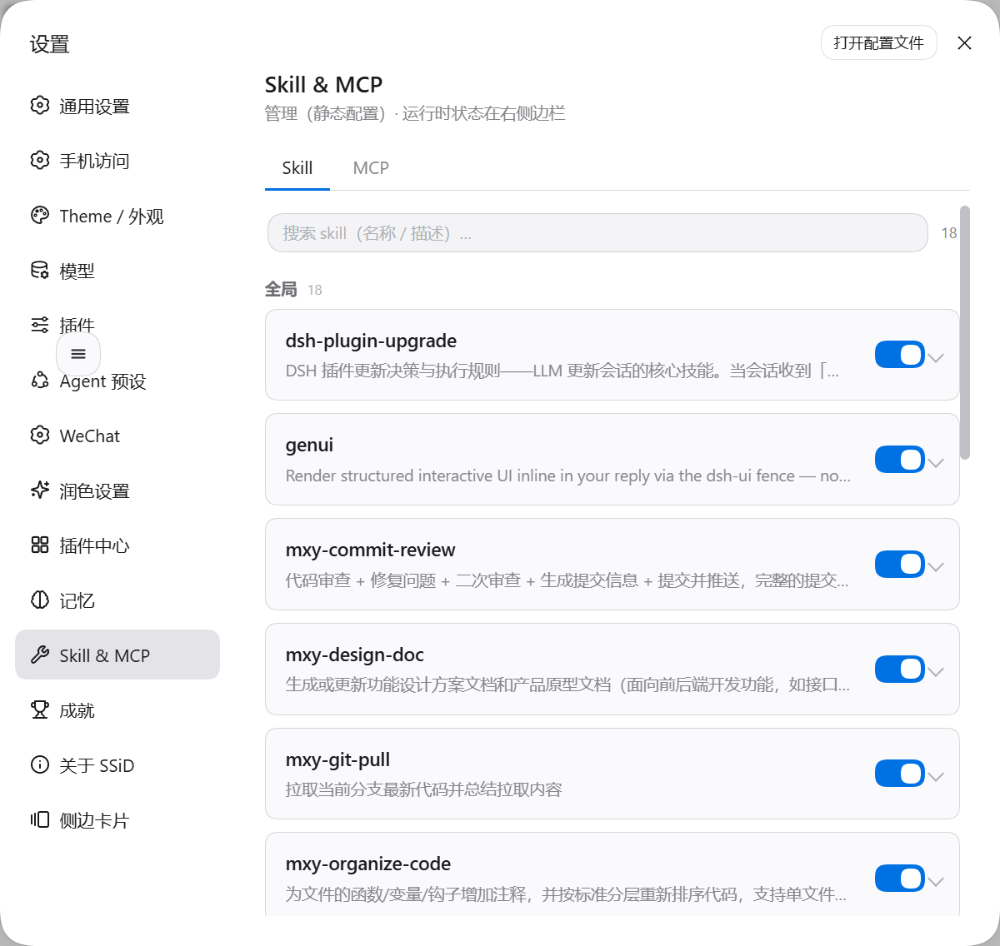
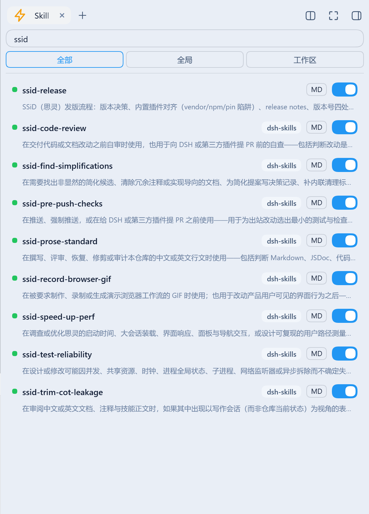
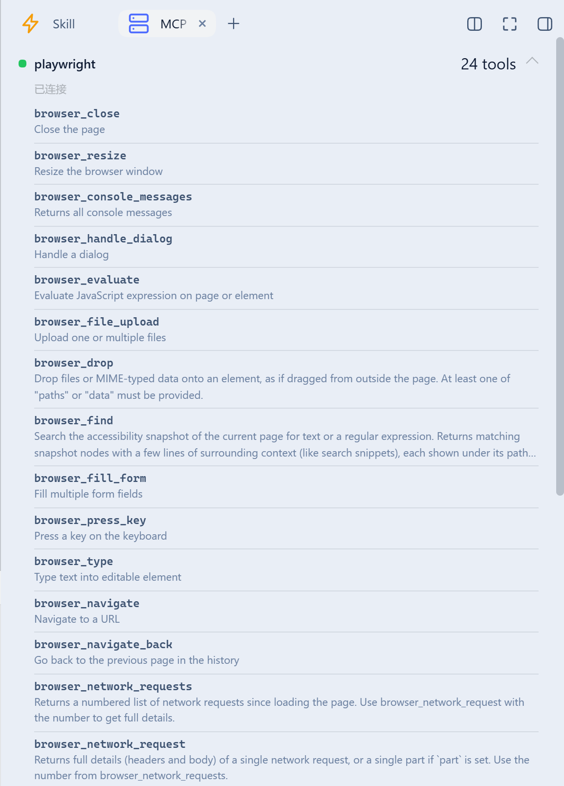

# dsh-skill-mcp-center

本插件属于 **`@max-null/*` 插件系列**——这一系列共同构成 **[SSID（思灵 · Seek Soul in Darkness）](https://github.com/Max-Null/seek-soul-in-darkness)** 桌面体验。SSID 是整合它们的盒：`dsh-capture` · `dsh-chat-rail` · `dsh-chinese-thinking` · `dsh-draft-polish` · `dsh-guardian` · `dsh-habit` · `dsh-memory` · `dsh-node-appearance` · `dsh-plugin-center` · `dsh-quick-toolbar` · `dsh-skill-mcp-center` · `dsh-ssid-panels` · `dsh-ssid-zh-ui` · `dsh-achievements`。

This plugin belongs to the **`@max-null/*` family** — a set of plugins that together form the **[SSID (思灵 · Seek Soul in Darkness)](https://github.com/Max-Null/seek-soul-in-darkness)** desktop experience.

Skill & MCP management center for [DeepSeek Harness](https://github.com/deepseek-ai/deepseek-harness) (`dsh`) — manage skills and MCP servers in Settings, with live MCP status in the sidebar.

Skill 与 MCP 管理中心：在设置里管理 skills 与 MCP 服务器，右侧边栏查看 MCP 实时状态。

## Features / 功能

- **Skill management / Skill 管理** — browse every skill by tier (system / user / workspace / runtime), toggle model invocation via the `disable-model-invocation` frontmatter (disk-backed skills only). Covers skills shipped **inside plugin packages** (e.g. `@max-null/dsh-skills`), not just the user-level roots — the host-level skill filesystem is disabled in web-app, so a plugin's own `skills/` directory would otherwise be invisible while its skills are loaded and in effect.
- **MCP management / MCP 管理** — add / edit / remove `mcp-client` servers, enable/disable without deleting config, all **hot-applied** through `ctx.loader` (no restart).
- **Live status / 实时状态** — a sidebar "MCP" tab (via `dsh-better-sidebar`) showing per-server connection state; **click a server row to expand its tools' names and descriptions** (collapsed by default — a server can expose dozens of them). Names come from `tools.schemas()`; the redundant `mcp__<server>__` prefix is hidden while the full name stays on hover. Polled while visible and following the session.
- **Skin-compatible / 皮肤兼容** — every color uses `var(--dsw-*)` tokens.

## 截图

### 设置页：集中管理

装完后设置里多出「Skill & MCP」一项，可逐条控制各模型对 Skill/MCP 的可见性。**入口：** 设置 → Skill & MCP



### 侧栏：Skill 一览

搜索 + 命名空间筛选（全部 / 全局 / 工作区），每条带开关与 `MD`（查看 SKILL.md）。**插件包内自带的 skill 同样列出**，并标出来源插件——下图里 8 个 `ssid-*` 来自 `dsh-skills`，而用户级的 `ssid-release` 没有来源标签，这正是两者的区别：



### 侧栏：MCP 状态与工具

每个 `mcp-client` 服务器的连接状态与工具数；**点服务器行展开**工具清单（默认收起，避免几十个工具占满面板）。工具名取自工具表、描述取自 `tools.schemas()`，冗余的 `mcp__<server>__` 前缀隐去（全名留在 hover）：




## Install / 安装

```sh
dsh plugin --profile web add github:Max-Null/dsh-skill-mcp-center
# or from npm, once published / 或通过 npm（发布后）
dsh plugin --profile web add @max-null/dsh-skill-mcp-center
```

Restart `dsh web`, then open Settings → Skill & MCP. The sidebar "MCP" tab appears only when `dsh-better-sidebar` is installed (optional peer).

## Development / 开发

```sh
pnpm install
pnpm build   # tsc (host) + esbuild (browser bundle)
```

## License / 许可

[MIT](./LICENSE)

## SSID 系列

